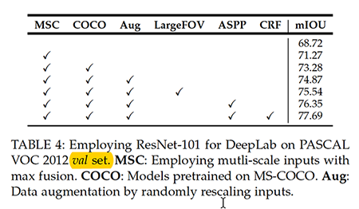
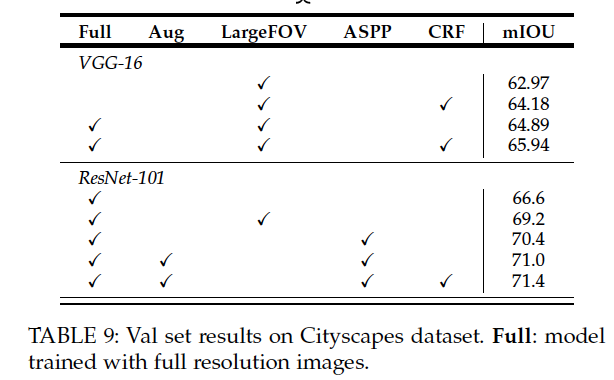

## DeepLab

Deeplabv1: [http://ethereon.github.io/netscope/#/gist/f3643b581154e8d6f26bde092e8363ad](http://ethereon.github.io/netscope/#/gist/f3643b581154e8d6f26bde092e8363ad)

Deeplabv2: [http://ethereon.github.io/netscope/#/gist/ff41a61a5384146fc099511a5075e1f9](http://ethereon.github.io/netscope/#/gist/ff41a61a5384146fc099511a5075e1f9)

Totally, PascalVOC 30K iterations, Cityscapes 45K iterations.

lr schedule:

Dataset|Schedule
------------ | -------------
PascalVOC|
Cityscapes|

scale ratio 4:9 or 8:18? to be decided.

Dataset |scale|epoch_iters|image size| batch size| prefetch speed|
------------ | -------------| -------------| -------------| -------------| -------------
VOC | 4|3020|473*473|14|1.2items/s
Cityscapes|9|3825|672*672 |7|1.2items/s

### sobel FPN

Arch | Val mIoU
------------ | -------------
deeplabv2.naked.fpn.standard(lr10,scale8) |67.8%,66.5%(second time)|
deeplabv2.naked.fpnstandard.learnable.sobel.channelwise(lr10)|67.8%|
deeplabv2.naked.fpn.standard.scale10(lr10)|67.1|
deeplabv2.naked.fpn.standard.scale10(lr12)|--|
------------ | -------------
deeplabv2.naked.fpn(lr10,scale8)) 165.41MB | 68.3%(strange result, too high), 65.4%(second time ),66.8%(third time)|
deeplabv2.naked.fpn.learnable.sobel.channelwise(lr10,2order)|67.8%,66.9%(second time)|
deeplabv2.naked.fpn.learnable.sobel.channelwise.1order(lr10)| 68.2%,68.4%(second time)|
deeplabv2.naked.fpn.learnable.sobel.channelcross.1order.py(lr10)|67.3|
deeplabv2.naked.fpn.learnable.sobel.channelwise.1order.relu|67.1(epoch9)|
deeplabv2.naked.fpn.learnable.sobel.resblock.1order.py(lr10)|68.6|
deeplabv2.cs.naked.fpn(lr10)) 165.41MB |55.2|
deeplabv2.cs.naked.fpn.learnable.sobel.resblock.1order|last 5 epoch:(55.4,54.4,56.5,55.2,54.4)|
deeplabv2.cs.naked.fpn.learnable.sobel.channelwise.1order(lr10)|57.0|
deeplabv2.naked.fpn.scale10(lr10)) 165.41MB |68.1|
deeplabv2.naked.fpn.scale12(lr10)) 165.41MB |66.2|
deeplabv2.naked.fpn.bilinear(lr10)|66.2%|
------------ | -------------
deeplabv2.naked.fpn.lr1,165.41MB|63.4%|
deeplabv2.naked.fpn.learnable.sobel.channelwise.lr1,165.41MB|67.3%|
deeplabv2.naked.fpn.learnable.sobel.channelcross.lr1|65.1%|

### GCN

Arch |official Val mIoU |Val mIoU
------------ | -------------|----------
deeplabv2.naked.gcn(lr10)| 74.1 with resnet150,coco+pascal+BSDS |66.8(buggy)|
deeplabv2.voc.imagesize473.gcnbaseline||67.5|
deeplabv2.voc.imagesize473.gcnbaseline.channelwise||65.9|

### trimap

Arch | Val mIoU
------------ | -------------
Deeplabv2-resnet101(no multi-branch,no ASPP,with MSF,1GPU,bs8,trimap) | 60.26%
Deeplabv2-resnet101-cs(edgemix) | non-converge
Deeplabv2-resnet101-pascal(edgemix) | non-converge

### sobel

Arch | Val mIoU
------------ | -------------
deeplabv2.naked | baseline: **70%**
Deeplabv2-resnet101(no multi-branch,no ASPP,with MSF,1GPU,bs8,edge) | 69.49%
Deeplabv2-resnet101(no multi-branch,no ASPP,with MSF,1GPU,bs8,edgescale) | 69.66%
Deeplabv2-resnet101(no multi-branch,no ASPP,with MSF,1GPU,bs8,edge.conv3) | 69.00%
Deeplabv2-resnet101(no multi-branch,no ASPP,with MSF,1GPU,bs8,sobel.lr10) | 68.1%,68.7%
Deeplabv2-resnet101(no multi-branch,no ASPP,with MSF,1GPU,bs8,sobel) | 67.4%,69.6%
~~Deeplabv2-resnet101(no multi-branch,no ASPP,with MSF,1GPU,bs8,sobel-res234)~~ | non-converge
~~Deeplabv2-resnet101(no multi-branch,no ASPP,with MSF,1GPU,bs8,sobellast)~~ | 66.3%
~~Deeplabv2-resnet101(no multi-branch,no ASPP,with MSF,1GPU,bs8,sobel.head)~~ | 50.2%
deeplabv2.naked.edge.learnable.sobel,258MB | 70%
deeplabv2.naked.edge.learnable.sobel.channelwise,163.75MB | **69.9%**
deeplabv2.naked.edge.learnable.sobel.channelwise.lr10,163.75MB | **70.3%**
deeplabv2.naked.edge.learnable.sobel.channelwise.lr1.newcode|71.1%|
deeplabv2.naked.edge.learnable.sobel.channelwise.lr10.newcode|71.3%|

### boundary statistics

Params| boundary| inner
------------ | -------------| -------------
SPK,kernel=19| 61.87,81.9,72.49|68.40,94.65,80.07
baseline,kernel=19|60.85,81.47,72.28|66.14,93.49,80.35
SPK,kernel=15|60.17,80.36,70.92|69.68,94.89,80.57
baseline,kernel=15|59.40,80.10,70.98|66.28,93.28,80.28
SPK,kernel=11|58.51,78.76,69.55|68.52,94.11,80.01
baseline,kernel=11|58.51,78.58,70.05|67.21,93.65,79.59

### Result On Pasal VOC

MSF on pascalvoc MSF all tild size: 321*321

Arch |metadata| Val mIoU 
------------ | -------------| -------------
Deeplabv2-resnet101(no multi-branch,no ASPP,with MSF,4GPU,bs32) || 73.65%(log not found)
Deeplabv2-resnet101(no multi-branch,no ASPP,with MSF,1GPU,bs8) | |69.3%
Deeplabv2-resnet101(no multi-branch,no ASPP,no MSF,1GPU,bs8) | |68.6%
deeplabv2.voc.size512|rs-nearest,flip,crop;deeplabv2-largedilation;first_batch_lr=2.5e-4;first-batch-lr=2.5e-4;lr_schedule=[(2, 1e-4), (4, 1e-5), (6, 8e-6)];epoch_scale=8;max_epoch=10|68.9
deeplabv2.voc.size512.randomresizefix|rs-bilinear,flip,crop;deeplabv2-largedilation;1gpu;first-batch-lr=2.5e-4;lr_schedule=[(2, 1e-4), (4, 1e-5), (6, 8e-6)];epoch_scale=8;max_epoch=10|68.1
deeplabv2.voc.size512.randomresizefix.officiallr|rs-bilinear;(2/3 1e-3, 1/3 1e-4)| epoch 7,50%(:cry:)
deeplabv2.voc.size512.randomresizefix.4gpu|rs-bilinear,flip,crop;deeplabv2;msf;4gpu;first_batch_lr = 2.5e-4;lr_schedule = [(2, 1e-4), (6, 1e-5)];epoch_scale = 6;max_epoch = 8|69.9%
deeplabv2.voc.epoch6|first_batch_lr = 2.5e-4;lr_schedule = [(2, 1e-4), (4, 1e-5)];epoch_scale = 6;max_epoch = 6|67.2%
deeplabv2.voc.imagesize473|imagesize:473;first_batch_lr = 2.5e-4;lr_schedule = [(2, 1e-4), (4, 1e-5), (6, 8e-6)];epoch_scale = 8;max_epoch = 10; **compared with deeplabv2.voc.size512, differ in (1). imagesize 512x10, here is 473x15, lr_multi =10, here is lr_multi=5** |71.5
deeplabv2.voc.imagesize473.spk||72.1|
deeplabv2.voc.imagesize473.spk4||72.3|
### Human Segmentation

Arch |metadata| Val mIoU 
------------ | -------------| -------------
|Deeplabv3 global segmentation|official 92||
|deeplabv2.voc.imagesize473.human||83.69 in epoch9??|

### Pascal in Slim
Params | Val mIoU
------------ | -------------
slim.deeplabv2.voc.imagesize473| 58.8
deeplabv3.voc.imagesize473|63.2
deeplabv3.voc.imagesize473|**71.6**
deeplabv3.voc.imagesize473.scale12|70.4
deeplabv3.voc.imagesize513.scale4.lrmultfix.noASPP.fortune|68.8
deeplabv3.voc.imagesize513.scale4.lrmultfix.fortune|71.2
deeplabv3.voc.imagesize513.scale4.lrmultfix.tune|68.9(slowly move down)
deeplabv3.voc.imagesize513.scale4.lrmultfix.tune.betagammafix|69.7(slowly move down then up)
slim.deeplabv2.dilation6.voc.imagesize473|**70.6**

### DenseCRF Grid Search

Params | Val mIoU
------------ | -------------
deeplabv2.voc.size512(baseline)|68.9
bi_w = 4, bi_xy_std = 67, bi_rgb_std = 3, pos_w = 3, pos_xy_std = 1| --
 bi_xy_std = 67, bi_rgb_std = 3| 68.9
  bi_xy_std = 67, bi_rgb_std = 10|--

### Result On Cityscapes(offical: deeplabv2 val mIoU:71.4% With Full+Aug+ASPP+CRF)

Arch | Val mIoU
------------ | -------------
Deeplabv2-resnet101(no multi-branch,no ASPP,with MSF(321x321),1GPU,bs8, 321x321,scale3) | 63.6
Deeplabv2-resnet101(no multi-branch,no ASPP,with MSF(1024x2048),1GPU,bs1,full,scale3) | 66.52
deeplabv2.cs.resnet101.scale8 | 50% in epoch8,stopped(:cry:)
deeplabv2.cs.resnet101.scale3| nan (:cry:)
deeplabv2.cs( new deeplab,res5-dilation2),upsample 8x   | cost:nan(:cry:)
deeplabv2.cs.newlr(first_batch_lr = 2.5e-4;lr_schedule = [(2, 1e-4), (4, 1e-5)];epoch_scale = 3;max_epoch = 6)|35.5%
deeplabv2.cs.imagesize672(scale:3)|70.87
deeplabv2.cs.imagesize672.scale18|**74.21** ([test:72.67](https://www.cityscapes-dataset.com/evaluation-results/?submissionID=984))

**notice:** The validation mIOU for this repo is  all achieved  with multi-scale and left-right flippling.

## Devils in version3

* image size=513; batch size=16;

* The proposed model is trained with output stride = 16, and then during inference we apply output stride = 8 to get more detailed feature map. 

* multi-GPU training;

* After training on the trainaug set with 30K iterations and initial learning rate = 0.007, we then freeze batch normalization
parameters, employ output stride = 8(via dilation to control it), and train on the official PASCAL VOC 2012 trainval set for another 30K iterations and smaller base learning rate = 0.001.

* how to evaluate

Arch | Pre | After
------------ | -------------| -------------
deeplabv3.voc.imagesize513.scale4.lrmultfix.noASPP.fortune| 68.9 |59 |

## Ideas

*  Semi Supervised Semantic Segmentation Using Generative Adversarial Network
*  Embedding human skeleton to furthur optimize human segmentation
*  [Semantic Image Synthesis via Adversarial Learning](https://github.com/dongzhuoyao/pytorchgo/tree/master/example/SISviaAL)
*  Reinforcement learning
*  embed traditional method
*  [Semantic-aware  Urban Scene Adaption](https://github.com/Peilun-Li/SG-GAN)
* setup a few-shot segmentation dataset.
* [Weakly Supervised Semantic Segmentation Based on Web Image Co-segmentation](https://ascust.github.io/WSS/)
* Instance-Level Salient Object Segmentation
* [Learning Affinity via Spatial Propagation Networks](https://arxiv.org/abs/1710.01020)
*  [A Classification Refinement Strategy for Semantic Segmentation](https://arxiv.org/abs/1801.07674)
* [Statistically Motivated Second Order Pooling](https://arxiv.org/abs/1801.07492)
* [Spatial Temporal Graph Convolutional Networks for Skeleton-Based Action
Recognition](https://arxiv.org/abs/1801.07455)
*  [LIFT](https://github.com/cvlab-epfl/tf-lift)
* use [Pose-Guided-Person-Image-Generation](https://github.com/charliememory/Pose-Guided-Person-Image-Generation) to realize human segmentation

## Target

*  slim deeplabv2 pascal reproduce
*  slim deeplabv2 Cityscapes reproduce
*  slim deeplabv2 Mapillary reproduce
* larger batch size use gradient checkpoint
