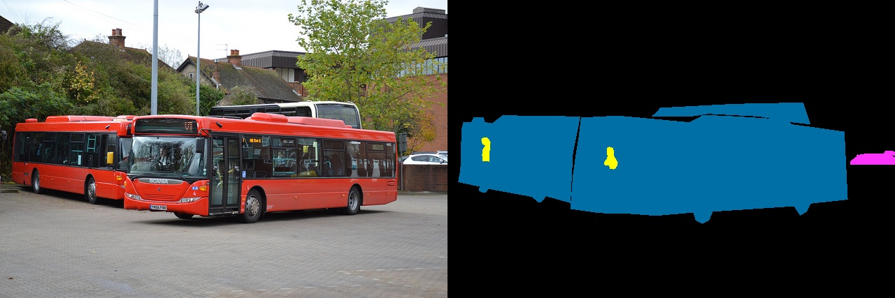
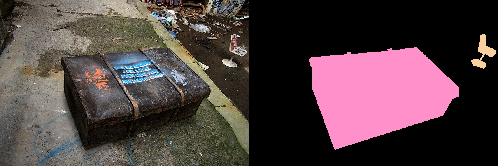

## 标注样例

### COCO_train2014_000000581738_car_person_bus.jpg

file name: COCO_train2014_000000581738_car_person_bus.jpg

annotations: Several buses are in the middle of the image, there are some people in these buses. In the right of the image is some cars.

### COCO_train2014_000000581739_vase.jpg

file name: COCO_train2014_000000581739_vase.jpg

annotations: Three vases are in the middle of the image.

### COCO_train2014_000000581906_chair_suitcase.jpg

file name: COCO_train2014_000000581906_chair_suitcase.jpg

annotations: A suitcase is in the center of the picture, and in the right top of the image is a chair.

## 保存格式

file_name#annotations

以#符号隔开，每行一个记录

比如:

COCO_train2014_000000581738_car_person_bus.jpg#Several buses are in the middle of the image, there are some people in these buses. In the right of the image is some cars.
COCO_train2014_000000581739_vase.jpg#Three vases are in the middle of the image.
COCO_train2014_000000581906_chair_suitcase.jpg#A suitcase is in the center of the picture, and in the right top of the image is a chair.

